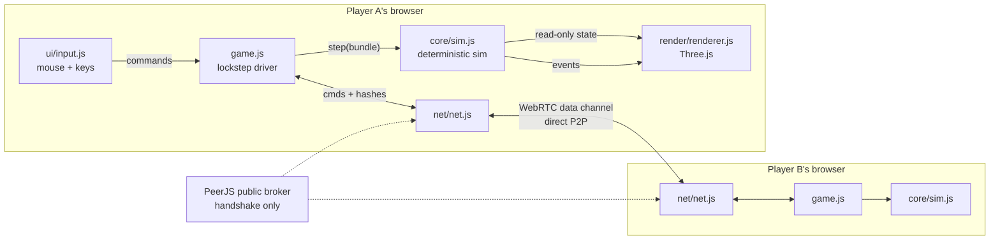
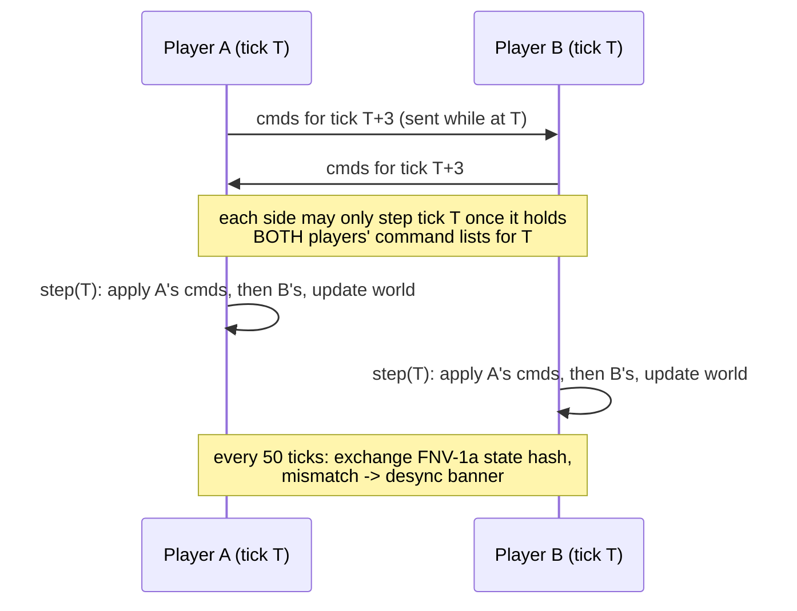

# webRTS Architecture

Technical reference for how the game works. Companion to
[DEVLOG.md](./DEVLOG.md), which tells the story; this explains the machine.

## System overview



Key invariant: **state never crosses the wire and the renderer never writes
state.** The two sims stay identical because they execute identical command
bundles on identical ticks from an identical seed.

## The lockstep loop

Sim runs at **10 ticks/sec** (`TICK_MS=100`); rendering at display rate with
interpolation. Input delay is **3 ticks** (300ms) — enough to hide typical
jitter, short enough to feel like a 90s RTS.



If the opponent's bundle for tick T hasn't arrived, the sim stalls (the
"Waiting for opponent..." banner) rather than guessing. Ticks 0..2 are
pre-seeded with empty bundles so the game can start.

Single-player uses the same driver with the gate removed: the AI's command
list is generated inline each tick as player 1, so AI games and network games
exercise the same code path.

### Hidden-tab safety

Browsers suspend `requestAnimationFrame` in background tabs, which would
freeze the local sim and therefore stall the *opponent*. A 100ms
`setInterval` fallback keeps `game.update()` ticking (without rendering)
whenever `document.visibilityState === "hidden"`.

## Determinism rules (core/)

| Rule | Implementation |
| --- | --- |
| No floats in state | positions/speeds/ranges are fixed-point ints, `FP = 256` per tile |
| No `Math.sqrt` | integer Newton `isqrt`; distance comparisons use squared distance where possible |
| No `Math.random()` | mulberry32 on `Math.imul` (32-bit int ops are engine-identical), host-chosen seed |
| No transcendentals | movement normalizes with `isqrt`; the renderer may use `atan2`/`sin` freely (visual only) |
| Stable iteration | entities update in creation (id) order; command bundles apply player 0 then player 1; A* ties break on node index |
| Stable arithmetic ranges | 48x48 map keeps all intermediates < 2^31 (max coord 12,288 fp; dist² ≤ ~3×10⁸) |

The checksum (`sim.checksum()`) folds tick, both mineral counts, and every
entity's `(id, x, y, hp)` through FNV-1a. It's cheap enough to run every
gated tick; it's *sent* every 50.

## Simulation structure

`step(bundle)` in strict order:

1. snapshot `px,py` per entity (render interpolation)
2. apply command bundle (validation is authoritative here — the UI's checks
   are cosmetic)
3. update units in id order (state machines: idle / move / attackmove /
   attack / gather / build)
4. update buildings (training queues, spawn at nearest free tile)
5. pairwise separation pushes (i<j by id), then re-eject units from blocked
   tiles
6. remove dead entities, emit death events
7. recompute fog every 3rd tick (per player: 0 unseen / 1 explored / 2
   visible)
8. win check: a player with zero buildings loses

Worker gather is a three-phase loop (`to` → `mining` (18 ticks) → `return`,
8 minerals per trip) with automatic re-target when a patch depletes and
auto-gather for freshly trained workers.

Pathfinding: A* over the tile grid (rocks + building footprints block),
8-directional, corner cutting forbidden, then a line-of-sight smoother drops
redundant waypoints. Close-range chases skip A* and beeline, letting
separation resolve contact.

## Rendering (render/)

- Ground is a single `CanvasTexture` (8px/tile): terrain color and **fog
  shading are painted into the same canvas**, repainted only when the sim's
  fog updates. No overlay plane, no per-tile meshes.
- Entities are lazily-created mesh groups keyed by entity id; a per-frame
  diff removes visuals for dead ids. Positions lerp `px→x` by the
  accumulator alpha.
- Enemy units render only on visible tiles; buildings and minerals persist
  once explored (StarCraft memory rule).
- Effects (tracers, death rings) are transient objects fed by sim events —
  the sim never knows about them.
- Camera: orbit target on the ground plane, fixed ~53° pitch, yaw rotation,
  dolly zoom 10–55 units.

## Networking (net/)

PeerJS with ids `webrts-v1-<CODE>`, where CODE is 5 chars from an
ambiguity-free alphabet (no 0/O/1/I). Host registers the id with the public
broker; guest connects to it; `reliable: true` gives an ordered, reliable
data channel (lockstep needs both). After the handshake the broker is out of
the loop. Host picks the map seed and sends `{k:"start", seed}`; host is
player 0, guest player 1.

Message protocol (entire wire format):

```
{k:"start", seed}                       host -> guest, once
{k:"cmds", t, c:[...], h?, ht?}         both directions, every tick
```

## Command set

```
move        {ids, x, y}          formation targets around the point
attackmove  {ids, x, y}          engage anything acquired en route
attack      {ids, targetId}
stop        {ids}
gather      {ids, targetId}      workers only
build       {workerId, building, tx, ty}   cost deducted, site spawned
train       {buildingId, unit}   cost + supply checked, queued (max 5)
```

Anything a player can do, the AI does through this same list — and a replay
system would just be this list with timestamps.

## Balance data (v1)

| | Cost | Supply | HP | DPS | Range | Speed | Build |
| --- | --- | --- | --- | --- | --- | --- | --- |
| Worker | 50 | 1 | 45 | 4.4 | melee | 2.7 t/s | 8s |
| Marine | 50 | 1 | 55 | 6.7 | 4.5 t | 2.4 t/s | 10s |
| Brute | 90 | 2 | 120 | 10.9 | melee | 2.1 t/s | 14s |
| Command Post | 400 | +10 | 1200 | — | — | — | 50s |
| Supply Depot | 100 | +8 | 450 | — | — | — | 18s |
| Barracks | 150 | — | 750 | — | — | — | 30s |

Economy: 8 minerals/trip, 18-tick mine time, patches hold 1,500. Start: 1
Command Post, 5 workers, 50 minerals.
